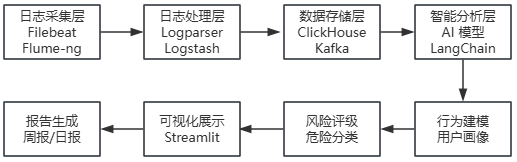

# Log Analysis AI Assistant

> 日志分析 AI 助手 — UEBA + 大模型驱动的用户行为异常检测系统


---

## 快速启动

### 1. 环境准备

```bash
# 克隆项目
git clone <repo-url>
cd Log_Analysis_AI_Assistant

# 创建虚拟环境
python -m venv .venv

# 激活（Windows）
.venv\Scripts\activate
# 激活（Linux/Mac）
source .venv/bin/activate

# 安装依赖
pip install -r requirements.txt

# 配置环境变量
cp .env.example .env
# 编辑 .env，填入 ClickHouse 地址和 AI API Key
```

### 2. 启动服务

```bash
# 启动 Kafka + ClickHouse（Docker，Linux VM 上执行）
docker compose -f tests/collectors/docker-compose-full.yml up -d

# 运行主程序（自动建表 → 插测试数据 → AI 强化 → 启动前端）
python -m src.main
```

### 3. 单独启动前端（Windows）

```powershell
# 确保 .env 中 CLICKHOUSE_HOST 指向 VM 的 IP
streamlit run src/visualization/dashboard.py
```

打开 `http://localhost:8501`

---

## 数据流



> 日志源 → Filebeat/Kafka → 解析器 → ClickHouse → UEBA Baseline 构建 → Validation 评分 → AI 强化用户基线 → Streamlit Dashboard

---

## 项目结构

```
src/
├── main.py                 # 主入口（一键启动）
├── collectors/             # 日志采集（Filebeat/Flume）
├── parsers/                # 日志解析（正则/JSON）
├── storage/                # 数据存储（ClickHouse/Kafka/ES）
├── behavior/               # UEBA 行为建模
│   ├── baseline_builder.py     # 基线构建
│   ├── baseline_store.py       # 基线存储
│   ├── score_calculator.py     # Validation 评分
│   ├── baseline_reinforcement.py  # AI 强化基线
│   └── ueba_management_service.py  # 管理入口
├── ai/                     # AI 分析（多平台 API 调用）
└── visualization/          # Streamlit 前端
    └── dashboard.py
```

---

## 技术栈

| 组件 | 用途 |
|------|------|
| Python 3.9+ | 后端语言 |
| ClickHouse | 日志存储 + 统计分析 |
| Kafka | 消息队列缓冲 |
| Streamlit | Web 前端 |
| 智谱AI / Kimi / OpenAI | 大模型分析 |
| Docker Compose | 一键部署 Kafka + ClickHouse |

---

## 界面

| 页面 | 功能 |
|------|------|
| 📡 实时日志流 | 实时日志展示 + 统计指标 |
| 👥 UEBA 异常排行 | 用户风险排行 + 事件详情（可折叠 + 分页） |
| 🛡️ 安全评分看板 | 安全评分趋势 + 风险分布 + 简报 |
| 🧠 AI 分析 + 强化基线 | AI 异常分析 + 基线强化建议（可筛选用户） |
| 🔍 历史查询 | 多条件检索 + CSV/Excel/PDF 导出 |

---

## 配置参考 (`.env`)

```ini
# ClickHouse（必填）
CLICKHOUSE_HOST=192.168.1.100
CLICKHOUSE_PORT=8123
CLICKHOUSE_USER=lingluody
CLICKHOUSE_PASSWORD=your_password
CLICKHOUSE_DATABASE=log_analysis

# AI 平台（至少填一个）
AI_PLATFORM=zhipu
ZHIPU_API_KEY=your_key
ZHIPU_MODEL=glm-4-flash
```

---

## License

MIT
